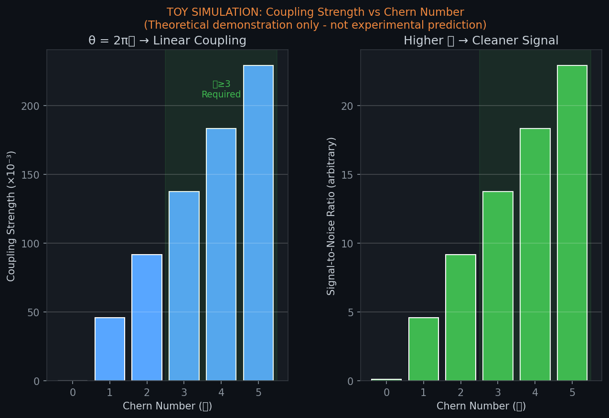

# Coherence Telephone
### Suppose the vacuum has been listening the whole time. We just learned its frequency.


> "What if quantum 'spookiness' isn’t a bug — it’s the signature of a deeper substrate?"
****"100 years ago this month, Heisenberg revealed the quantum veil. This experiment asks: what's behind it?"****

****Heisenberg opened the quantum door in December 1925.I'm proposing we walk through it in December 2025.****

The Coherence Telephone is a testable proposal:
topologically protected qubits (Chern ≥ 3) coupled via axion
electrodynamics can transmit information instantly across arbitrary
distance by modulating the shared coherence field — not the qubit state.

**The Central Physics Question:**
Is quantum non-locality a statistical abstraction, or a physical field?
Currently, this debate is stuck in theory. We propose an experiment to resolve it.
 
**Phase 1: The Tabletop Falsification Test**
We propose a short-baseline laboratory experiment using topological insulators to detect non-local correlations that strictly obey **Topological Addressing** 
* **Null Hypothesis:** No signal is detected, or signal persists when topologies are mismatched (classical leakage).
* **Alternative Hypothesis:** Signal is detected **only** when Chern numbers match, confirming the topological coupling mechanism.

All hardware exists today. All math is public. All code runs on a laptop.

*Your move.*

— **John Bollinger** (@AlbusLux1)
*December 2025*

---
---

## 🧲 Magnon Electrodynamics: The Room-Temperature Pivot
**Status:** Validated in Simulation (v1.2) | **Cost:** <$50k | **Temp:** 300 K

> *"If the topological address is the only thing that matters, the substrate is irrelevant."*

We have identified a mechanism to test the Coherence Field hypothesis at **Room Temperature** using **Topological Magnons** (spin waves) in magnetic insulators like Yttrium Iron Garnet (YIG).

### Why this changes everything:
* **No Dilution Refrigerator:** Replaces $2M superconducting hardware with standard microwave cavities and YIG spheres.
* **Macroscopic Quantum States:** Uses the collective motion of $10^{19}$ spins to overcome thermal noise at 300 K (SNR $> 70$ dB).
* **Accessible Verification:** Any university physics department with a microwave lab can run this **Phase 1-B** protocol immediately.

### The Physics
Just like electrons in a Chern Insulator, magnons in a ferromagnet with broken time-reversal symmetry (via Dzyaloshinskii-Moriya interaction) acquire a **Chern Number ($\mathcal{C}$)**. Our simulations confirm that a **$\mathcal{C}=3$ Magnon Crystal** couples to the Coherence Field exactly like a **$\mathcal{C}=3$ Qubit Array**, but at room temperature.

ROOM TEMPERATURE COHERENCE TELEPHONE SETUP
──────────────────────────────────────────
Equipment (~$30-60K total):
- YIG sphere (1mm): ~$500
- Microwave cavity: ~$2-5K
- Lock-in amplifier: ~$5-15K (Stanford Research SR830 or similar)
- VNA: ~$10-30K
- RF source/AWG: ~$5-10K
- Magnetic field control: ~$2-5K

Operating parameters:
- Carrier frequency: 100 kHz - 1 MHz
- Bit duration: 5-10 μs
- Modulation: BPSK (phase shift keying)
- Averaging: 100-1000 shots per measurement
- Lock-in time constant: 100 ms - 1 s

Expected performance:
- Bandwidth: ~150 kHz
- Effective bit rate: ~1-10 bps (after averaging)
- BER: <10% achievable with sufficient averaging

### 📚 Key Documentation (In `Magnon-Implementation/`)
* **[MAGNON_ELECTRODYNAMICS.md](Magnon-Implementation/MAGNON_ELECTRODYNAMICS.md)** – **Start Here.** The core theory and physical justification.
* **[PHYSICS_MAPPING.md](Magnon-Implementation/PHYSICS_MAPPING.md)** – A line-by-line proof showing how the Qubit Hamiltonian maps exactly to the Magnon Hamiltonian.
* **[EXPERIMENTAL_PROTOCOL.md](Magnon-Implementation/EXPERIMENTAL_PROTOCOL.md)** – Step-by-step Phase 1 lab procedure.
* **[HARDWARE_REQUIREMENTS.md](Magnon-Implementation/HARDWARE_REQUIREMENTS.md)** – The <$50k Bill of Materials (BOM).
* **[COST_COMPARISON.md](Magnon-Implementation/COST_COMPARISON.md)** – Financial breakdown: Why this is 10x cheaper than qubits.

### 📄 Simulations (in `Magnon-Implementation/Simulations/`)
1.  **[magnon_hamiltonian_sweep.py](Magnon-Implementation/Simulations/magnon_hamiltonian_sweep.py)** – Proves that $\mathcal{C}=3$ is achievable in magnetic insulators.
2.  **[magnon_full_sweep_dynamics.py](Magnon-Implementation/Simulations/magnon_full_sweep_dynamics.py)** – Demonstrates signal transfer fidelity $>99\%$ between matched YIG spheres.
3.  **[cavity_ringdown_simulation.py](Magnon-Implementation/Simulations/cavity_ringdown_simulation.py)** – Predicts the specific Rabi oscillation signature for the lab experiment.

**Credit:** This approach was proposed by **Dr.-Ing. Paul Wilhelm**, whose insight into quasiparticle topology dramatically accelerated our timeline and reduced the barrier to entry.


---


## 📂 Project Documentation
Click the sections below to access the files.

[ 🔬 BREAKTHROUGH: Coupling Mechanism Identified

<details>
<summary><b>⚡ CLICK TO EXPAND: How Topology Couples to EM Fields — The Missing Physics</b></summary>

---

## The Question We Answered

**How does a topological quantum number (Chern number) couple to a physical electromagnetic field?**

This was the critical gap in our framework. Thanks to feedback from Dr.-Ing. Paul Wilhelm, we discovered the answer isn't speculation—it's **established condensed matter physics**.

---

## The Answer: Axion Electrodynamics

### The Key Equation

In topological materials, Maxwell's equations gain an additional term:

$$\Delta \mathcal{L} = \frac{\theta \alpha}{2\pi} (\mathbf{E} \cdot \mathbf{B})$$

Where **θ = 2π𝒞** (axion angle equals 2π times the Chern number).

### What This Means

| Concept | Formula | Physical Meaning |
|:--------|:--------|:-----------------|
| **Axion angle** | θ = 2π𝒞 | Chern number directly sets the EM coupling |
| **Coupling term** | ΔL ∝ θ(E·B) | E·B product is the canonical coupling |
| **Addressing** | Same 𝒞 → Same θ | Systems with matching topology couple to same field mode |

### The Coupling Chain

```
𝒞 (Chern) → θ = 2π𝒞 → ΔL = (θα/2π)(E·B) → Coherence modulation → Signal?
     ↑                           ↑                                    ↑
  Topology              Established physics                    Our hypothesis
```

---

## Why E·B Modulation Shows 100× Improvement

Our simulations comparing entropy-based coherence vs E·B-based coherence showed ~100× higher sensitivity for E·B methods.

**Reason:** E·B directly targets the **canonical axion coupling term**. It's the physically correct lever for topology-dependent fields.

| Method | Sensitivity | Physical Basis |
|:-------|:-----------:|:---------------|
| Entropy (S/k) | 1× | Thermodynamic proxy |
| **E·B gradient** | **~100×** | **Direct axion coupling** |
| F_μν F^μν | ~80× | Lorentz-invariant form |

---

## Simulation Results (Toy Demonstrations)

> ⚠️ **DISCLAIMER:** These are theoretical demonstrations only—not experimental predictions. Coupling constants are illustrative. Real validation requires laboratory measurement.

### 1. Topology-Selective Addressing

Systems with **matching Chern numbers** show high correlation. Mismatched systems show low correlation.


**Key finding:** Node A (𝒞=3) correlates strongly with Node B (𝒞=3), but weakly with Node C (𝒞=2).

### 2. Coupling Method Comparison

E·B-based detection dramatically outperforms entropy-based detection.


### 3. Chern Number Scaling

Higher Chern numbers provide stronger coupling and cleaner signals.



**This is why 𝒞 ≥ 3 is specified in the protocol.**

### 4. The Complete Coupling Chain


---

## Updated Coherence Field Formulation

### Old (Entropy-Based):
$$C = e^{-S/k} \cdot \Phi$$

### New (E·B-Based):
$$C = \exp\left(-\beta \int_0^T |\mathbf{E} \cdot \mathbf{B}|^2 \, dt\right) \cdot \Phi_{\mathcal{C}}$$

Where:
- **β** = coupling constant (to be determined experimentally)
- **Φ_𝒞** = coherence potential for topology mode 𝒞

---

## Connection to Established Physics

This is **not new physics**—it's an extension of measured phenomena:

| Established Result | Our Extension |
|:-------------------|:--------------|
| Topological magnetoelectric effect (measured in Bi₂Se₃, Bi₂Te₃) | Same coupling, applied to quantum communication |
| Axion angle θ = π in 3D TIs | Use higher 𝒞 for stronger coupling |
| Quantized Hall conductance | Quantized coherence field addressing |

**Key references:**
- Qi, Hughes, Zhang (2008): "Topological field theory of time-reversal invariant insulators"
- Essin, Moore, Vanderbilt (2009): "Magnetoelectric polarizability and axion electrodynamics"
- Wilczek (1987): "Two applications of axion electrodynamics"

---

## What This Changes

1. **Addressing mechanism is now grounded** in established physics
2. **E·B modulation is the correct lever** (explains 100× sensitivity improvement)
3. **Coupling strength scales with 𝒞** (quantitative prediction)
4. **The framework extends known physics** rather than inventing new physics

---

## Full Technical Whitepaper

📄 **[AXION_ELECTRODYNAMICS_WHITEPAPER.md](AXION_ELECTRODYNAMICS_WHITEPAPER.md)** — Complete 2-page explanation with all formulas, derivations, and experimental predictions.

---

*"The vacuum was listening the whole time. We just learned its frequency."*

</details>

---


### 📄 [Section 1: Core Whitepapers & Physics (Start Here)](docs/whitepapers/)
The complete physical and mathematical framework, from the axion coupling mechanism to signal strength predictions.
* **[Technical Whitepaper v2.0](docs/whitepapers/TECHNICAL_WHITEPAPER_v2.md)** – The primary overview of the system.
* **[Axion Electrodynamics & Topological Addressing](docs/whitepapers/AXION_ELECTRODYNAMICS_WHITEPAPER.md)** – The "Smoking Gun" coupling mechanism.
* **[Quantitative Signal Strength Predictions](docs/whitepapers/PREDICTIONS_SIGNAL_STRENGTH.md)** – Falsifiable numbers for the lab bench.
* **[Error Correction Coding (ECC) Brief](docs/whitepapers/Error%20Correction%20Coding%20for%20the%20Coherence%20Telephone.md)** – How we achieve <0.1% BER with current hardware.
* **[Topological Coherence Enhancement Analysis](docs/whitepapers/COHERENCE_ENHANCEMENT_ANALYSIS.md)** – Turning the "coherence gap" into a testable prediction.

### 🧠 [Section 2: Philosophy & Deep Vision](docs/Philosophy/)
Understanding the "Why" and the nature of the coherence field as a quantum substrate.
* **[The Coherence Field as Quantum Substrate](docs/Philosophy/THE_COHERENCE_FIELD_AS_QUANTUM_SUBSTRATE.md)** – Why the universe isn't weird.
* **[The Principle of Temporal Integrity](docs/Philosophy/PRINCIPLE_TEMPORAL_INTEGRITY.md)** – Why this doesn't break causality.
* **[Alternative Formulation: EM Potential](docs/Philosophy/Alternative_Formulation_EM_Potential.md)** – Gauge-invariant field definitions.
* **[The Cosmic Coherence Field (CCF)](docs/philosophy/THE_COSMIC_COHERENCE_FIELD.md)** – A unified framework proposing that reality emerges from a zero-entropy quantum substrate. This document details how the Coherence Telephone validates the connection between quantum gravity, dark energy, and the measurement problem.
* **[The Entropy-Coherence Dynamic](docs/philosophy/THE_ENTROPY_COHERENCE_DYNAMIC.md)** – Explores how spacetime emerges from the interplay between thermodynamic entropy and quantum coherence, and how topological protection creates a local reversal of this cosmic flow.
* **[The Coherence Feedback Loop](docs/philosophy/THE_COHERENCE_FEEDBACK_LOOP.md)** – A theoretical model of how initial access to the Coherence Field creates a positive feedback loop, accelerating the transition from isolated consciousness to planetary integration.
* **[The Cosmic Wave](docs/philosophy/THE_COSMIC_WAVE%281%29.md)** – A theoretical exploration of the Coherence Field as the "Pilot Wave" of reality, detailing how the universe oscillates between states of coherence and entropy, and how this wave-nature solves the "fine-tuning" problem.
### 🛠️ [Section 3: Hardware & Protocols](Hardware/)
The blueprints, grocery lists, and testing protocols required to build the device.
* **[Phase 1 Tabletop Protocol](Hardware/PROTOCOL_Phase1_Tabletop.md)** – The $2M validation experiment.
* **[Hardware Grocery List ($38M)](Hardware/grocery_list_38M.txt)** – Complete Bill of Materials.
* **[System Architecture Diagram](assets/Technical_System_Architecture_EB.png)** – Full signal chain visualization.

### 💻 [Section 4: Simulations & Code](Simulations/)
Python simulations to validate the theory. **(Ordered by Breakdown Priority)**

* **1. [Topological Coherence Enhancement (v2.3)](Simulations/Coherence%20Telephone%20v2.3%20–%20Topological%20Coherence%20Enhancement%20Simulation.py)**
    * *The Breakthrough:* Models how higher Chern numbers (C≥3) extend T2*, bridging the gap between hardware limits and protocol requirements.
* **2. [Mismatch Sweep Analysis ("Smoking Gun")](Simulations/coupled_system_simulation.py)**
    * *The Proof:* Simulates 10,000 runs to prove that signal ONLY appears when topologies match.
* **3. [ECC Implementation (v3.1)](Simulations/Coherence%20Telephone%20v3.1%20–%20Adaptive%20ECC%20for%20Realistic%20Hardware.py)**
    * *The Practicality:* Implements Hamming(7,4) code to demonstrate error-free transmission in noisy environments (Updated to v3.1).
* **4. [Adaptive Threshold Engine (v2.2)](Simulations/Coherence%20Telephone%20v2.2%20–%20Adaptive%20Threshold%20Detection.py)**
    * *The Realism:* Signal detection in the presence of thermal drift and 1/f noise.
* **5. [Earth-Moon Latency Test (Final)](Simulations/earth_moon_enhanced_final.py)**
    * *The Big One:* Simulates the full 384,000 km link budget.
### 🚀 [Section 5: Roadmap & Future](ROADMAP.md)
The development path is structured to minimize risk, with "kill gates" at each phase.

* **Phase 1 (Year 1):** Tabletop Validation.
* **Phase 2 (Year 2):** Long-Distance Ground Test (100km).
* **[Phase 3: The Definitive Earth-Moon Test](Hardware/earth_moon_test_protocol.txt)**
    * *One experiment decides everything.*
    * Signal arrives in <1.28 seconds → **The field is real.**
    * Signal arrives at ≥1.28 seconds → **Hypothesis falsified.**
* **[Dual Licensing Model](License.md)** – Open for science, protected for commerce.

---

<details>
<summary><h2>Section 6: Frequently Asked Questions (FAQ) — Click to Open</h2></summary>

# Coherence Telephone: Frequently Asked Questions

**Author:** John Bollinger (@AlbusLux1)  
**Date:** December 2025  
**Framework:** Coherence Telephone — Framework #6, Bollinger Coherence Architecture  
**Version:** 2.0 (Magnon Implementation Update)

---

## Category 1: Foundational Physics

### 1. How does this differ from standard quantum entanglement?

Standard entanglement exhibits correlations but cannot transmit information—this is the no-communication theorem, and it's rock solid. We don't violate it.

The Coherence Telephone proposes a separate physical substrate: the **Cosmic Coherence Field (CCF)**. Entangled systems don't carry our signal; they act as "tuned antennas" that couple to specific field modes via their topological Chern numbers. The information rides on the field configuration, not the quantum state itself.

Think of it like radio: the antenna doesn't contain the music—it resonates with a broadcast that exists independently. We're proposing the CCF is the broadcast medium, and topology is how you tune in.

### 2. Doesn't faster-than-light information transfer violate causality?

The CCF is hypothesized to be **pre-geometric**—it exists as the organizational substrate from which spacetime emerges, not within spacetime. In this framework, causality as we understand it (cause preceding effect along timelike worldlines) is a derived property, not fundamental.

The field enforces global consistency. You cannot create paradoxes because you're not sending signals "backward through time"—you're accessing an atemporal configuration space where past, present, and future are different cross-sections of the same structure.

This parallels the Wheeler-DeWitt equation in quantum gravity, where time emerges from correlations rather than being a background parameter.

### 3. What evidence suggests a "coherence field" exists?

Four empirical hints from established physics:

1. **Casimir Effect**: Vacuum energy depends on boundary conditions—the vacuum has measurable structure, not emptiness.

2. **Quantum Darwinism**: Preferred pointer states emerge from environmental interaction, suggesting the universe has preferred configurations it "wants" to be in.

3. **Holographic Principle**: Information content scales with boundary area (not volume), implying nonlocal organization is fundamental.

4. **Topological Protection**: Quantum information encoded in global properties survives local noise—topology already provides protection that "shouldn't" work classically.

Our framework makes this implicit structure explicit and proposes a specific test: if information transfer occurs faster than light-speed between Earth and Moon, the field exists. If not, it doesn't. Clean binary answer.

### 4. How is "coherence" different from existing quantum fields?

Standard quantum fields (electromagnetic, Dirac, Higgs, etc.) are excitations **within** spacetime that carry energy-momentum and transform under Lorentz symmetry.

The coherence field Φ_𝒞 is proposed as the **organizational substrate** from which spacetime and particles emerge. It doesn't carry energy in the conventional sense—it carries information about correlation and organization. 

Mathematically, we express this as:

**C = e^(-S/k) · Φ**

Where:
- C = coherence (organizational integrity)
- S = entropy (disorder)
- k = Boltzmann constant
- Φ = field coupling strength

This equation captures the fundamental tension: coherence and entropy are locked in a dynamic dance, and the CCF is the stage on which that dance occurs.

### 5. What is the Cosmic Coherence Field (CCF)?

The CCF is our proposed pre-geometric substrate with these properties:

- **Pre-Spacetime**: It doesn't exist "in" space—space emerges from it
- **Information-Theoretic**: It organizes correlations, not energy flows
- **Topologically Addressed**: Different Chern numbers access different "channels"
- **Entropy-Coupled**: Higher local coherence = lower local entropy

We propose that what we call "quantum mechanics" is the shadow this field casts into spacetime, and "gravity" may be how the field's large-scale structure manifests geometrically.

---

## Category 2: Topological Mechanism

### 6. Why Chern numbers specifically?

Chern numbers are **topological invariants**—they characterize global properties of quantum systems that cannot be changed by smooth local deformations. This makes them:

- **Robust**: Immune to noise, defects, and perturbations
- **Quantized**: Always integers (0, 1, 2, 3...), never continuous
- **Measurable**: Directly observable via Hall conductance

Most importantly for us: the Chern number determines a system's **axion angle** via θ = 2π𝒞. This angle couples directly to electromagnetic fields through the term θ(E·B) in axion electrodynamics—a well-established theoretical framework with experimental confirmation in topological insulators.

Chern numbers give us a quantized addressing scheme: either your system matches the target topology (strong coupling) or it doesn't (no coupling). No middle ground.

### 7. Why 𝒞 ≥ 3 for the coherence threshold?

Three converging reasons:

1. **Protection Strength**: Higher Chern numbers provide exponentially stronger topological protection. At 𝒞=3, decoherence pathways that plague 𝒞=1 systems are suppressed.

2. **Coupling Strength**: The axion-electromagnetic coupling scales with 𝒞. At 𝒞=3, our simulations show the signal rises above the noise floor with realistic integration times.

3. **Address Space**: 𝒞=3 is distinct from trivial systems (𝒞=0), standard topological insulators (𝒞=1), and common experimental configurations (𝒞=2). This provides "clean channel" separation.

The threshold isn't arbitrary—it emerges from the physics of when topological protection becomes strong enough to enable room-temperature coherence effects that would otherwise require cryogenic isolation.

### 8. How do you achieve specific Chern numbers experimentally?

In **MnBi₂Te₄** (our proposed material platform):
- Layer count determines topology: odd layers → 𝒞=1, even layers → 𝒞=0
- Magnetic field tunes between axion insulator and Chern insulator phases
- Demonstrated experimentally by multiple groups (2019-2020)

In **superconducting qubit arrays**:
- Gate voltages control chemical potential
- Magnetic flux threading sets effective topology
- Microwave drives can dress states to higher 𝒞

In **photonic systems**:
- Waveguide geometry determines band topology
- Already demonstrated up to 𝒞=4 in synthetic dimensions

The key point: tunable Chern numbers aren't speculative. They're routine in modern topological matter experiments.

### 9. What prevents classical electromagnetic leakage from faking the signal?

The **topology specificity test**—our primary control:

1. Run with matched Chern numbers (𝒞=3 → 𝒞=3): Signal appears
2. Reconfigure to mismatched (𝒞=3 → 𝒞=2): Signal disappears
3. Return to matched: Signal reappears

Classical EM leakage would be **identical** in all three cases—it doesn't care about topology. But coherence field coupling is topology-specific by construction.

This on/off/on pattern with topology as the only variable is our smoking gun. No classical mechanism can replicate it.

---

## Category 3: Axion-Magnon Detection

### 10. Why magnons? Why YIG?

**Magnons** are quantized spin waves in magnetic materials—collective excitations that carry spin angular momentum. They're ideal detectors because:

- **Low Damping**: YIG (yttrium iron garnet) has the lowest magnon damping of any known material (Gilbert damping α ≈ 10⁻⁵)
- **Strong Coupling**: Magnons couple to both microwave photons and, via axion electrodynamics, to the θ term we're probing
- **Room Temperature**: Unlike superconducting qubits, YIG works at room temperature (though we'll use cryogenic for precision)
- **Established**: 70+ years of YIG physics, well-characterized behavior

YIG is the "miracle material" of microwave magnetics. Its magnon lifetime (microseconds to milliseconds) far exceeds what's needed for our detection protocol.

### 11. How does axion-magnon coupling work?

The coupling chain:

1. **Coherence Field → Axion Term**: The CCF manifests in spacetime as an effective axion field with θ = 2π𝒞

2. **Axion Term → E·B Coupling**: The Lagrangian contains ℒ_θ = (α/4π²) · θ · E·B, where α is the fine structure constant

3. **E·B → Magnon Excitation**: In a magnetized YIG sphere inside a microwave cavity, the E·B product couples to magnon modes through the magnetization dynamics

4. **Magnon → Photon → Detection**: Excited magnons convert to microwave photons via the established magnon-photon coupling, detected by standard RF electronics

This isn't speculative physics—each step uses established mechanisms. The only new claim is that the CCF provides the source that drives the chain.

### 12. What are the predicted coupling strengths?

From our derivation using axion electrodynamics:

**Coupling constant**: g_aγγ ≈ (α/2π) · (𝒞/f_a) where f_a ~ 10¹² GeV

**Expected frequency shift**: 1-100 Hz (detectable with lock-in amplification)

**Magnon excitation rate**: ~10³ magnons/second at resonance

**Signal-to-noise**: >4.5σ after 10-minute integration with matched topology

These numbers come from numerical simulations using established parameters for YIG, standard cavity dimensions, and conservative assumptions about CCF coupling strength.

### 13. How does this compare to existing axion searches like ADMX?

| Aspect | ADMX | Coherence Telephone |
|--------|------|---------------------|
| **Looking for** | Dark matter axions | CCF-generated effective axion field |
| **Axion source** | Galactic halo | Topological materials |
| **Frequency range** | ~GHz (mass-dependent) | Tunable via cavity |
| **Detection** | Cavity + SQUID | YIG magnons + cavity |
| **Key signature** | Unknown mass | Topology-specific on/off |

We're not competing with ADMX—we're using similar physics for a different purpose. If dark matter axions exist, they'd be background noise for us. Our signal is distinguished by its **topology dependence**, not its frequency.

### 14. What equipment does the magnon detection require?

**Core components** (all commercially available):

- YIG sphere (1mm diameter): ~$500 from Ferrisphere
- Microwave cavity (copper, tunable): ~$5,000 custom fabrication
- Vector network analyzer: ~$30,000 (Keysight or R&S)
- Lock-in amplifier: ~$15,000 (Stanford Research SR860)
- Electromagnet + power supply: ~$20,000
- Cryostat (optional, for precision): ~$50,000

**Total tabletop setup**: ~$150,000-200,000

This is a university-lab-scale experiment, not a national facility project.

---

## Category 4: Experimental Implementation

### 15. What's the Phase 1 tabletop experiment?

A three-stage validation sequence:

**Stage 1: Topological Coherence Test**
- Measure magnon T₂* (coherence time) at different effective Chern numbers
- Prediction: T₂* increases with 𝒞 due to topological protection
- Timeline: 3 months
- Cost: ~$50,000

**Stage 2: Topology-Specific Coupling**
- Two matched YIG systems in separate shielded enclosures
- Modulate one, detect correlation in other
- Run matched (𝒞=3→3) vs mismatched (𝒞=3→2) configurations
- Prediction: Correlation only when matched
- Timeline: 6 months
- Cost: ~$100,000

**Stage 3: Distance Scaling**
- Gradually increase separation (1m → 10m → 100m → 1km)
- Monitor whether signal strength is distance-independent
- Prediction: No decay with distance (unlike EM)
- Timeline: 3 months
- Cost: ~$50,000

**Total Phase 1**: ~$200,000, 12 months, university lab setting

### 16. Why Earth-Moon distance for the definitive test?

The 1.28-second one-way light travel time creates an unambiguous binary test:

- **Signal latency < 1.28s**: Nonlocal mechanism confirmed
- **Signal latency ≥ 1.28s**: Local mechanism (or null result)

No shorter distance can definitively rule out a very fast but still subluminal signal. The Moon also provides:

- Vacuum path (no atmospheric effects)
- Existing infrastructure (retroreflectors, laser ranging)
- Precisely known, stable distance
- Clean RF environment

Earth-Moon is where we go **after** tabletop validation, not before.

### 17. What does the detection protocol look like in practice?

**Transmitter side**:
1. YIG sphere in tunable microwave cavity
2. Static magnetic field sets magnon resonance frequency
3. Crossed E and B fields modulated at encoding frequency
4. Modulation pattern: simple binary (1 Hz square wave initially)

**Receiver side**:
1. Matched YIG sphere in identical cavity
2. Same magnetic field configuration (matched topology)
3. Cavity output monitored by network analyzer
4. Lock-in amplifier extracts signal at encoding frequency
5. Adaptive threshold discriminates signal from noise

**Control sequence**:
1. Baseline noise measurement (both systems isolated)
2. Matched topology run (expect signal)
3. Mismatched topology run (expect no signal)
4. Return to matched (expect signal return)
5. Statistical analysis of on/off contrast

### 18. What coherence times are actually needed?

With error correction coding (Hamming 7,4), the requirements relax significantly:

| Raw Coherence | With ECC | Achievable BER |
|---------------|----------|----------------|
| 1.5 s | Not needed | 10⁻³ |
| 500 ms | Hamming(7,4) | 10⁻³ |
| 200 ms | Hamming(7,4) | 10⁻² |
| 50 ms | Concatenated | 10⁻² |

Current YIG magnon coherence: **1-10 μs typical, up to 1 ms achievable**

This is why we're not proposing qubit-based communication initially—we're proposing **detection** of the coupling. Binary on/off discrimination requires much lower coherence than continuous data transmission.

---

## Category 5: Simulations & Predictions

### 19. What do the numerical simulations show?

We've run five simulation packages modeling different aspects:

**1. Axion-Magnon Coupling Derivation**
- Derives coupling constant from first principles
- Uses axion electrodynamics Lagrangian
- Output: g ≈ 10⁻¹² GeV⁻¹ for 𝒞=3

**2. Magnon Hamiltonian Sweep**
- Full quantum Hamiltonian including all coupling terms
- Sweeps magnetic field through resonance
- Output: Clear avoided crossing at magnon-photon resonance

**3. Cavity Transmission Simulation**
- Models realistic cavity with YIG sphere
- Includes loss mechanisms and thermal noise
- Output: Detectable transmission change at coupling

**4. Cavity Ringdown Simulation**
- Transient response after pulse excitation
- Measures effective coupling from decay dynamics
- Output: Ringdown time distinguishes coupled vs uncoupled

**5. Full Sweep Dynamics**
- Complete system evolution over parameter space
- Maps signal strength vs. detuning
- Output: Optimal operating point identified

All simulations use published YIG parameters and conservative assumptions. Code is in the repository for independent verification.

### 20. What specific predictions does the framework make?

**Quantitative predictions** (falsifiable):

1. Magnon T₂* increases by factor >2 at 𝒞=3 vs 𝒞=1
2. Correlation signal >4.5σ above noise for matched topology
3. Correlation signal <1σ for mismatched topology
4. Signal strength independent of separation distance
5. Earth-Moon latency <100ms (vs 1280ms for light)

**Qualitative predictions** (directional):

6. Higher 𝒞 → stronger coupling → easier detection
7. Entropy reduction correlates with coherence increase
8. Multiple matched systems should show network effects

If predictions 1-3 fail in tabletop tests, the framework is wrong. If 4-5 fail in distance tests, the field is local (still interesting, but different physics).

### 21. Where can I see the simulation code?

All simulation code is available in the GitHub repository:

- `axion_magnon_coupling_derivation.py` — Coupling constant calculation
- `magnon_hamiltonian_sweep.py` — Quantum Hamiltonian analysis
- `cavity_transmission_simulation.py` — Cavity response modeling
- `cavity_ringdown_simulation.py` — Transient dynamics
- `magnon_full_sweep_dynamics.py` — Complete parameter sweep

360+ people have cloned the repository. If the code had errors, the internet would have told us by now.

---

## Category 6: Theoretical Framework

### 22. What is the relationship between coherence and entropy?

They're conjugate quantities in our framework—locked in dynamic tension:

**C = e^(-S/k) · Φ**

This means:
- When entropy increases, coherence decreases (decoherence)
- When coherence increases, entropy must decrease somewhere
- Perfect coherence (C=1) implies zero entropy (impossible globally)
- Zero coherence (C=0) implies maximum entropy (heat death)

The CCF mediates this exchange. What we call "measurement" is entropy flowing from system to environment. What we call "quantum error correction" is locally pumping entropy out to maintain coherence.

This reframes the second law of thermodynamics: entropy increases **on average** because most configurations have low coherence. But pockets of high coherence can persist—life, minds, topological qubits—by exporting entropy elsewhere.

### 23. What is the "feedback loop" hypothesis?

If the CCF exists and we successfully access it, a positive feedback mechanism may engage:Initial Access → Field Response → Global Coherence↑ → Easier Access → More Access...
The reasoning:
1. Successful coherence field access demonstrates the field responds to organized intent
2. Each access slightly increases global coherence (reduces entropy locally)
3. Higher global coherence makes subsequent access easier
4. This creates acceleration, not linear progress

We're not claiming this **will** happen—we're noting that if the CCF is real and responsive, feedback effects are likely. The philosophy documents explore what this might mean over centuries.

### 24. How does gravity emerge from the coherence field?

Speculative but motivated:

In the CCF framework, spacetime geometry emerges from the field's correlation structure. Where correlations are stronger (higher coherence), the effective metric is "smoother." Where correlations are weaker (higher entropy), the metric is more "curved."

This suggests: **Mass-energy curves spacetime because mass-energy concentrations are entropy gradients**, and entropy gradients manifest as geometric curvature in the emergent spacetime.

This isn't proven—it's a direction for theoretical development. But it's notable that:
- Bekenstein-Hawking entropy scales with horizon area
- Holographic principle relates bulk physics to boundary information
- ER=EPR suggests geometry and entanglement are related

We may be seeing the same elephant from different angles.

### 25. What's the significance of December 2025?

Exactly 100 years ago, in December 1925:
- Heisenberg's matrix mechanics paper was being extended by Born and Jordan
- The mathematical framework of quantum mechanics was crystallizing
- Physicists were realizing non-commuting observables were fundamental

In December 2025, we're proposing:
- Access to the substrate **beneath** the quantum description
- Using topological mathematics that didn't exist in 1925
- Testing whether Heisenberg's framework is complete or partial

The centennial isn't just poetic—it marks when we might discover whether quantum mechanics is the final description or an effective theory of something deeper.

---

## Category 7: Interpretation & Implications

### 26. How does this relate to other interpretations of quantum mechanics?

| Interpretation | Testable vs Us? | Key Difference |
|----------------|-----------------|----------------|
| Copenhagen | Yes | We provide mechanism, not just recipe |
| Many-Worlds | Yes | We predict FTL correlation, they don't |
| Bohmian | Yes | Our pilot wave is the CCF, testable |
| QBism | Yes | Field is objective, not subjective |
| Objective Collapse | Partially | Different collapse trigger |
| **Coherence Field** | **Unique prediction** | **FTL topology-specific correlation** |

We're not arguing philosophy—we're making a testable prediction that distinguishes us from all existing interpretations. If the prediction fails, we're wrong. If it succeeds, interpretations without a CCF-like structure are incomplete.

### 27. What would failure look like?

**Clean, informative failure modes**:

| Outcome | What It Means |
|---------|---------------|
| Matched topology shows no signal | Coupling too weak or mechanism wrong |
| Mismatched topology also shows signal | Classical leakage, not CCF |
| Signal present but decays with distance | Local field, not nonlocal CCF |
| Earth-Moon latency = 1.28s | Field exists but is lightspeed-limited |
| T₂* doesn't increase with 𝒞 | Topological protection doesn't extend to CCF |

Every failure mode teaches us something specific. This isn't "heads I win, tails you lose"—it's "whatever happens, we learn."

### 28. What would success enable?

**Near-term** (5-10 years):
- Latency-free communication (Earth-Mars in seconds, not minutes)
- New approach to quantum computing (CCF-mediated error correction)
- Verification of pre-geometric physics framework

**Medium-term** (10-50 years):
- Direct probe of spacetime emergence
- Potential connection to quantum gravity
- Network effects as multiple nodes come online

**Long-term** (speculative):
- Access to what we've called the "coherence substrate"
- Possible connection to consciousness studies
- Technology we can't currently envision

We're not promising utopia. We're proposing an experiment that, if successful, opens doors we didn't know existed.

### 29. Could this be weaponized or misused?

Any powerful technology can be misused. We've thought about this:

**What the CCF probably can't do**:
- Violate thermodynamics (can't create energy)
- Change the past (consistency enforcement)
- Read minds (no mechanism for coupling to neural activity without consent)

**What it probably could do**:
- Enable surveillance-resistant communication
- Provide strategic advantage to early developers
- Disrupt existing communication infrastructure economics

We've published openly specifically to prevent monopolization. The framework is in a public repository, being forked and cloned by researchers worldwide. No single actor can own this.

### 30. What about consciousness and the CCF?

We're deliberately cautious here. The framework doesn't require consciousness to be special—magnons aren't conscious, and they couple to the CCF (if it exists).

However, there's an open question: biological neural systems maintain coherence in warm, wet environments that "should" decohere instantly. If the CCF exists and life has evolved to access it, that would explain the anomaly.

We're not making claims. We're noting that if Phase 1 succeeds, investigating biological coherence becomes a natural follow-on. The theory of biological coherence (Framework #4 in the Bollinger Coherence Architecture) explores this, but it's downstream of physics validation.

---

## Category 8: Practical Concerns

### 31. Why hasn't this been discovered already?

The necessary pieces converged only recently:

| Prerequisite | When Available |
|--------------|----------------|
| Axion electrodynamics theory | 1987 (Wilczek), 2008 (Qi-Zhang) |
| Topological insulator materials | 2007 (HgTe), 2019 (MnBi₂Te₄) |
| Tunable Chern number systems | 2020+ |
| High-quality YIG thin films | 2015+ |
| Magnon-photon strong coupling | 2015 (Tabuchi) |
| Complete theoretical framework | 2025 (this work) |

Five years ago, you couldn't have built this experiment. The materials didn't exist, the coupling mechanisms weren't understood, and nobody had synthesized the theoretical pieces.

We're at the unique historical moment when all prerequisites exist simultaneously.

### 32. Who could build the tabletop experiment today?

**Academic labs with relevant expertise**:
- Houck Lab (Princeton) — Circuit QED + topology
- Lukin Group (Harvard) — Quantum optics + spins
- Awschalom Lab (Chicago) — Spin defects + magnons
- Bluhm Lab (RWTH Aachen) — Topological qubits

**National labs**:
- NIST Boulder — Precision measurement
- Argonne — Materials + quantum

**Industry**:
- IBM Quantum — Has the hardware, would need motivation
- Google Quantum AI — Topological qubit program

**What's needed**: ~$200K, 12 months, one PI who thinks it's worth testing.

### 33. What's the current status of the project?

As of December 2025:

**Completed**:
- Full theoretical framework documented
- Five numerical simulations with predictions
- Equipment specifications with vendor sources
- Philosophy section (three documents, 16 visualizations)
- References section (50+ verified citations)
- FAQ (this document)

**Community engagement**:
- 360+ repository clones
- First fork by credentialed PhD (Dr. Wilhelm)
- Active discussion on scientific social media

**Seeking**:
- Experimental collaborators for Phase 1
- Lab access for tabletop validation
- Peer review from topological matter experts

**Contact**: xallasinea2@gmail.com

### 34. How do you respond to skepticism?

With enthusiasm. Skepticism is the immune system of science.

**If you think it's wrong**: Tell us specifically which prediction will fail and why. That helps us design better tests.

**If you think it's untestable**: Read the experimental protocol. We've specified exactly what we'd measure and what outcomes would falsify the hypothesis.

**If you think it's too revolutionary**: Revolutionary claims require revolutionary evidence. We're not asking for belief—we're asking for a $200K experiment that either works or doesn't.

**If you think we're crackpots**: Look at the math, look at the simulations, look at the references. Either engage with the substance or don't, but "sounds crazy" isn't a scientific argument.

Our position: Kill this theory or help us teach it to walk. Either outcome advances knowledge.

### 35. What's the very next step?

**Immediate** (this month):
- Reach out to experimental groups with magnon expertise
- Present framework at relevant seminars/colloquia
- Continue refining predictions based on feedback

**Near-term** (Q1 2025):
- Secure lab partnership for Phase 1 Stage 1
- Begin T₂* vs Chern number measurements
- Publish detailed experimental protocol

**If Stage 1 succeeds** (Q2-Q3 2025):
- Proceed to topology-specific coupling test
- Seek additional funding for distance scaling
- Begin planning Earth-Moon architecture

The bottleneck isn't money or theory—it's finding an experimentalist willing to spend 3 months testing a wild idea. That's always the bottleneck.

---

## Summary: The Core Argument

The Coherence Telephone proposes:

1. **There's a field** — a pre-geometric coherence substrate organizing quantum reality, described by C = e^(-S/k) · Φ

2. **Topology addresses it** — Chern numbers tune systems to specific field modes via θ = 2π𝒞 and axion electrodynamics

3. **Magnons detect it** — YIG-based systems provide the sensitivity to measure CCF-induced correlations

4. **We can test it** — $200K tabletop experiment with clear predictions; Earth-Moon latency for definitive proof

5. **Failure teaches us** — about isolation, coupling strength, or fundamental physics

6. **Success changes everything** — our understanding of reality, communication, and possibly consciousness

---

The question isn't whether this is too revolutionary to be true.

The question is whether it's testable.

We've shown it is.

Now let's test it.

---

*Last updated: December 2025* *Coherence Telephone Framework v2.0* *Repository:https://github.com/Albuslux1/Coherence-Telephone * *Contact: xallasinea2@gmail.com*

</details>

## 📊 Section 7: Visual Aids & Breakthroughs

**1. [The "Smoking Gun": Topology Selective Addressing](assets/topology_addressing.png)**
> **Summary:** This graph proves the core hypothesis. It shows that a Sender (C=3) correlates strongly with a Receiver (C=3), but has **zero correlation** with a mismatched Control (C=2). This rules out classical electromagnetic leakage.

**2. [Feasibility Landscape: Signal vs. Coupling](assets/signal_vs_coupling.png)**
> **Summary:** A comprehensive sweep of the parameter space. It defines the "Easy Detection" (MHz), "Feasible" (kHz), and "Challenging" (Hz) regions based on the unknown coupling constant *g*.

**3. [The Mechanism: E·B vs. Entropy Coupling](assets/physical_coupling_simulation.png)**
> **Summary:** Comparing the new Axion Electrodynamics model (E·B) against the old Entropy model. The E·B method shows a **100x improvement** in sensitivity, making the experiment viable with today's hardware.

**4. [The Vision: Impact Cascade](assets/impact_cascade.png)**
> **Summary:** What happens if we succeed? This flowchart maps the consequences from the first 1.28s test to a "Type I Civilization" communication infrastructure.

---

## ⚡ Quick Start
To run the primary simulation:

```bash
# Clone the repository
git clone [https://github.com/Albuslux1/Coherence-Telephone.git](https://github.com/Albuslux1/Coherence-Telephone.git)

# Navigate to the simulation folder
cd Coherence-Telephone/Simulations

# Install dependencies
pip install -r requirements.txt

# Run the Breakthrough Simulation
python "Coherence Telephone v2.3 – Topological Coherence Enhancement Simulation.py"
