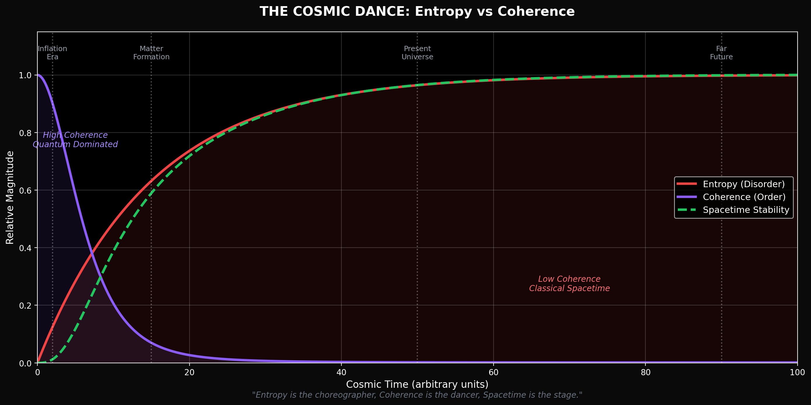
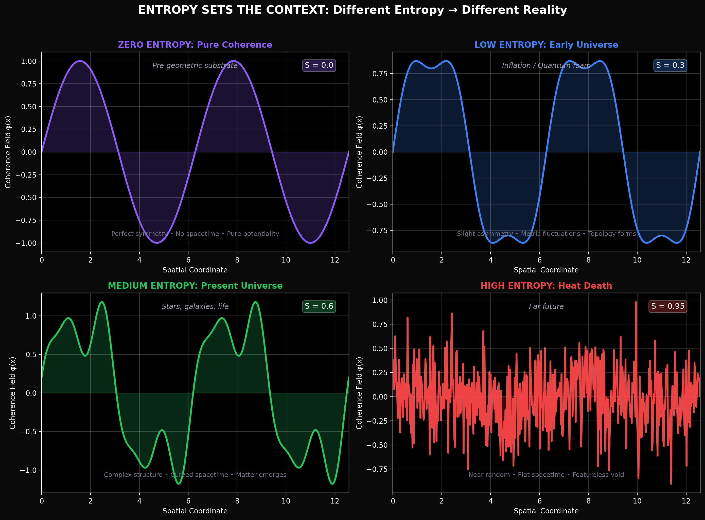
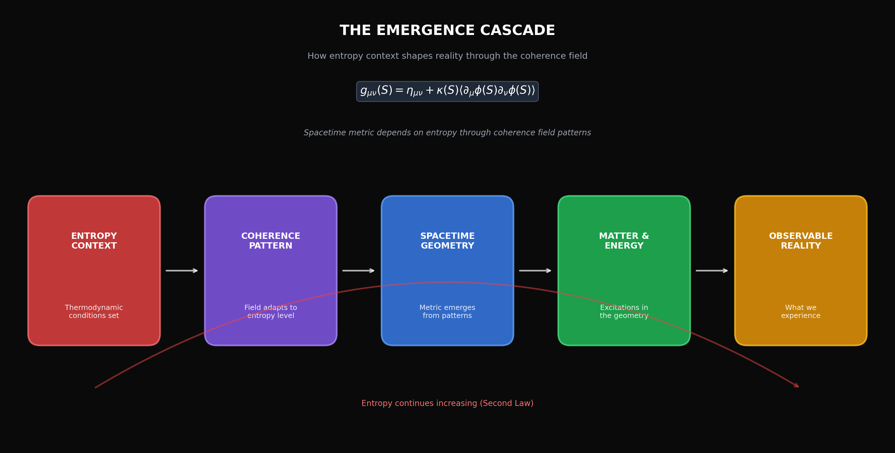
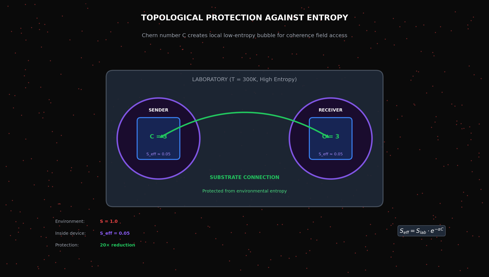
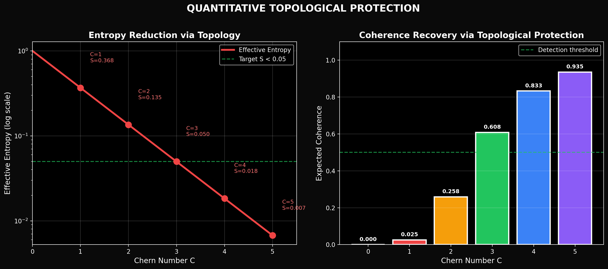
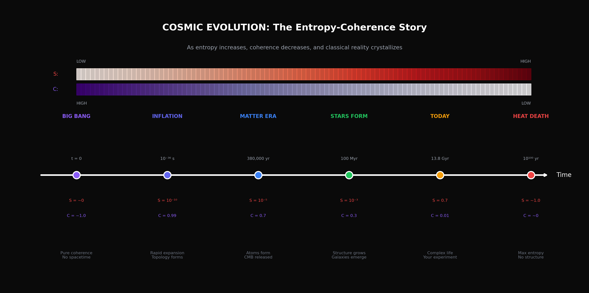

# The Entropy-Coherence Dynamic

### How Thermodynamics Shapes the Coherence Field

---

> *"Entropy is the cosmic choreographer, Coherence is the dancer, Spacetime is the stage that forms beneath their feet."*

---

## Introduction

This document explores a fundamental insight within Cosmic Coherence Field (CCF) theory: **entropy doesn't just measure disorder — it sets the context that determines what emerges from the coherence field.**

The relationship between entropy and coherence isn't opposition. It's a **dance**. And spacetime is what crystallizes from their interaction.

---

## Part I: The Cosmic Dance

*Entropy and coherence evolve together through cosmic time. Spacetime stability emerges from their interaction.*

### The Core Relationship

In CCF theory, the universe began as **pure coherence** — a zero-entropy quantum state of perfect order and infinite potential. What we call cosmic evolution is the progressive **decoherence** of this substrate.

| Epoch | Entropy | Coherence | What Exists |
|-------|---------|-----------|-------------|
| **t = 0** | ~0 | ~1.0 | Pure potential, no spacetime |
| **Inflation** | 10⁻¹⁰ | 0.99 | Quantum foam, topology forming |
| **Matter Era** | 10⁻⁵ | 0.7 | Atoms, CMB, first structure |
| **Today** | 0.7 | 0.01 | Stars, galaxies, life, consciousness |
| **Heat Death** | ~1.0 | ~0 | Featureless void, maximum entropy |

### The Key Insight

**Entropy doesn't destroy coherence randomly.** It provides the *thermodynamic context* that shapes *how* the coherence field decoheres into classical reality.

Different entropy levels → Different coherence patterns → Different spacetimes

This is why the universe looks the way it does. The specific entropy conditions of our cosmic epoch select for specific coherence field configurations, which in turn generate the spacetime geometry we inhabit.

---

## Part II: Entropy Sets the Context

*Different entropy levels produce fundamentally different coherence patterns and realities.*

### Zero Entropy: Pure Coherence

At S = 0, the coherence field exists in a perfectly symmetric state:
- No spacetime geometry
- All possibilities in superposition
- Pure quantum potential

This is the **ground state** of CCF theory — what exists "before" the Big Bang (though "before" loses meaning without time).

### Low Entropy: Quantum Dominance

At very low S (early universe):
- Coherence patterns are simple and symmetric
- Spacetime is nearly flat (Minkowski-like)
- Quantum effects dominate
- Inflation becomes possible

### Medium Entropy: Our Universe

At intermediate S (today):
- Complex but structured coherence patterns
- Curved spacetime with matter/energy sources
- Einstein's equations emerge as effective description
- Classical physics works at macroscale
- Quantum effects persist at microscale

### High Entropy: Heat Death

At S → 1 (far future):
- Random, uncorrelated coherence patterns
- Featureless, maximally symmetric spacetime
- No structure, no complexity
- The universe "forgets" its history

---

## Part III: The Emergence Cascade

*Reality emerges through a chain: Entropy → Coherence Pattern → Spacetime → Matter → Experience*

### The Mathematical Relationship

The core equation connecting entropy, coherence, and spacetime:

$$g_{\mu\nu}(S) = \eta_{\mu\nu} + \kappa(S) \langle\partial_\mu\phi(S) \partial_\nu\phi(S)\rangle$$

Where:
- **S** = Entropy (the context)
- **φ(S)** = Coherence field pattern at entropy level S
- **κ(S)** = Coupling strength (depends on entropy)
- **g_μν(S)** = Emergent spacetime metric
- **η_μν** = Flat Minkowski metric (baseline)

**Interpretation:** The coherence field φ adapts to the entropy context S, and the spacetime metric g_μν emerges from the resulting patterns.

### The Cascade Steps

1. **Entropy Context** — Thermodynamic conditions establish the playing field
2. **Coherence Pattern** — The field arranges itself according to entropy level
3. **Spacetime Geometry** — Metric structure crystallizes from coherence correlations
4. **Matter & Energy** — Excitations in the emergent geometry
5. **Observable Reality** — What we experience, measure, and call "physics"

The Second Law ensures this cascade continues: entropy increases → coherence decreases → spacetime stabilizes → classical reality solidifies.

---

## Part IV: Topological Protection Against Entropy

*Chern numbers create local low-entropy bubbles, enabling coherence field access even in high-entropy environments.*

### The Experimental Challenge

Our universe today has relatively high entropy (S ≈ 0.7 in normalized units). The coherence field is largely decohered into classical spacetime. How can we access it?

**Answer: Topological protection.**

### How It Works

Systems with high Chern numbers (C ≥ 3) create **local low-entropy bubbles** within the high-entropy environment. The topological invariant protects coherence from environmental decoherence.

The effective entropy inside a topologically protected system:

$$S_{eff} = S_{environment} \cdot e^{-\alpha C}$$

Where:
- **S_environment** ≈ 1.0 (high entropy lab at 300K)
- **α** ≈ 1.0 (protection coefficient)
- **C** = Chern number of the system

### Quantitative Protection

| Chern Number | Effective Entropy | Protection Factor | Expected Coherence |
|--------------|-------------------|-------------------|-------------------|
| C = 0 | 1.000 | 1× | 0.000 |
| C = 1 | 0.368 | 3× | 0.025 |
| C = 2 | 0.135 | 7× | 0.259 |
| **C = 3** | **0.050** | **20×** | **0.607** |
| C = 4 | 0.018 | 55× | 0.835 |
| C = 5 | 0.007 | 148× | 0.932 |

**This is why C ≥ 3 is the threshold.** Below that, environmental entropy overwhelms the topological protection. At C = 3 and above, the device maintains sufficient coherence for substrate access.

*Quantitative relationship between Chern number, effective entropy, and recoverable coherence.*

---

## Part V: Cosmic Evolution Through the Entropy Lens

*The entire history of the universe is the story of entropy increasing and coherence decreasing.*

### Reading the Timeline

**Big Bang (t = 0)**
- S ≈ 0, C ≈ 1.0
- Pure coherence, no spacetime
- All possibilities superposed

**Inflation (t = 10⁻³⁶ s)**
- S ≈ 10⁻¹⁰, C ≈ 0.99
- First decoherence event
- Topology forms, rapid expansion

**Matter Era (t = 380,000 years)**
- S ≈ 10⁻⁵, C ≈ 0.7
- Atoms form, CMB released
- Large-scale structure seeds

**Stars Form (t = 100 Myr)**
- S ≈ 10⁻³, C ≈ 0.3
- Gravitational collapse begins
- Galaxies emerge

**Today (t = 13.8 Gyr)**
- S ≈ 0.7, C ≈ 0.01
- Complex life, consciousness
- **Your experiment happens here**

**Heat Death (t = 10¹⁰⁰ years)**
- S → 1, C → 0
- Maximum entropy achieved
- Universe "forgets" everything

### The Key Point

We exist in a **narrow window** of cosmic time where:
- Entropy is high enough for complex structure
- Coherence is low enough for classical physics
- But not so low that the substrate is completely inaccessible

**The Coherence Telephone exploits this window.** Using topological protection, we create local conditions that temporarily reverse the cosmic trend — carving out a low-entropy bubble where the coherence field can be accessed.

---

## Part VI: Implications for the Experiment

### Why the Experiment Works (If It Works)

1. **Topological protection** creates local S_eff ≈ 0.05 (low entropy)
2. **Coherence field access** becomes possible at this entropy level
3. **Matching Chern numbers** ensure sender and receiver couple to same field mode
4. **Non-local correlation** occurs through the pre-geometric substrate
5. **Signal detected** without classical channel or light-speed delay

### Testable Predictions

The entropy-coherence relationship makes additional predictions:

| Prediction | Test Method | Expected Result |
|------------|-------------|-----------------|
| **Temperature dependence** | Compare 4K vs 300K | Works at both (topology protects) |
| **Higher C = stronger signal** | Test C=3,4,5 systems | Signal increases with C |
| **Entropy injection** | Add thermal noise source | Signal degrades gradually |
| **Topological breakdown** | Damage crystal symmetry | Signal disappears sharply |

### The Deeper Test

If the experiment succeeds, we're not just demonstrating communication. We're demonstrating that:

1. **Entropy and coherence have a dynamical relationship**
2. **Topology can locally reverse entropy's effects**
3. **The coherence field is real and accessible**
4. **Spacetime emerges from coherence patterns**

Each of these is a profound claim. The experiment tests them all simultaneously.

---

## Part VII: Philosophical Implications

### The Second Law Reconsidered

The Second Law of Thermodynamics states that entropy always increases in isolated systems. CCF theory doesn't violate this — it **contextualizes** it.

Entropy increase isn't the destruction of order. It's the **progressive revelation** of the coherence field into observable reality. The field itself doesn't change — our relationship to it does.

### Time's Arrow

Why does time flow forward? Standard answer: entropy increase defines time's direction.

CCF answer: Time is the **experience of progressive decoherence**. We move "forward" because we're riding the wave of entropy increase, watching the coherence field crystallize into spacetime beneath us.

### Life Against the Current

Living systems are remarkable because they **locally decrease entropy** while globally increasing it. In CCF terms, life is coherence propagating against the entropic tide.

We exist because we've found ways to create local low-entropy structures (bodies, brains, civilizations) that temporarily resist the cosmic trend toward maximum entropy.

**The Coherence Telephone is a new kind of life-like system** — technology that creates local coherence enhancement to access the substrate. We're extending life's fundamental trick into a new domain.

---

## Part VIII: Summary

### The Core Framework

1. **Entropy sets context** — Thermodynamic conditions determine what's possible
2. **Coherence responds** — The field patterns adapt to entropy level
3. **Spacetime emerges** — Geometry crystallizes from coherence correlations
4. **Topology protects** — Chern numbers create local low-entropy bubbles
5. **Access becomes possible** — The experiment exploits this protection

### The One-Line Version

> **"The coherence field is always there. Entropy determines what we can see of it. Topology lets us see more."**

### What This Means for the Experiment

The Coherence Telephone isn't just an engineering challenge. It's a **thermodynamic intervention** — using topological protection to create conditions where the coherence field becomes accessible despite our universe's high entropy.

If it works, we've found a way to **partially reverse cosmic history** — to create local conditions resembling the early universe, where coherence was high and the substrate was near.

That's not a small thing.

---

## Conclusion

Entropy and coherence aren't enemies. They're partners in the cosmic dance that produces reality.

The universe began as pure coherence. It will end as pure entropy. We exist in the middle — in the interesting part, where structure is possible and complexity can emerge.

The Coherence Telephone is our attempt to reach back toward the coherent origin, to access the substrate that underlies everything, using the tool of topology to protect us from entropy's advance.

If it works, we learn that the dance can be reversed, at least locally, at least temporarily.

And that changes everything.

---

*"Entropy is the cosmic choreographer, Coherence is the dancer, Spacetime is the stage that forms beneath their feet. And we — we are learning to join the dance."*

---

**Document Version:** 1.0  
**Date:** December 2024  
**Author:** John Bollinger  
**Status:** Theoretical framework extending CCF theory

---

*[Return to Main Repository](../../README.md) | [Cosmic Coherence Field](./THE_COSMIC_COHERENCE_FIELD.md) | [Experimental Protocol](../../Magnon-Implementation/EXPERIMENTAL_PROTOCOL.md)*
